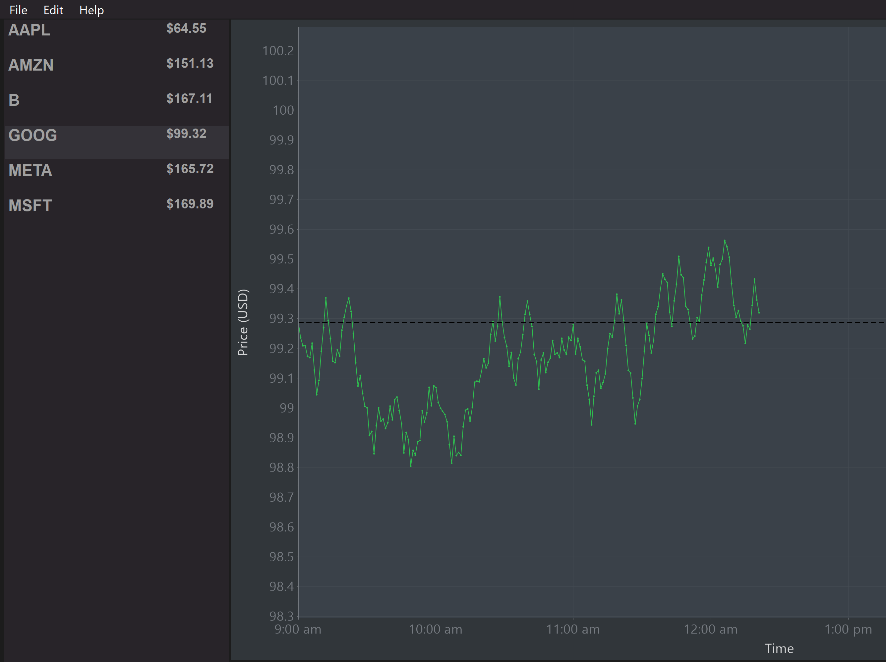

    

# ICE Instrument Monitor

# Getting Started:
1. Quick Start Method
For a quick start, utilize Help > Execute Debug Mode. This will open a pre-configured setup that demonstrates the functionality of the front end.

2. User Method
Alternatively, click Edit > sources (meant to simulate configuration of an API). Then, double-click on the left-most panel or utilize File > Add Ticker to open the `Add Symbol` window. Data will then be generated and displayed in the main panel.

3. Unit Tests
Unit tests are found in the `SimulationEngineTests` project. These are used to test and demonstrate functionality that is not easily demonstrated in the front end.

# Dependencies
- [ScottPlot](https://scottplot.net/)

# Assumptions
- The limited time frame of this project suggests a working application over a fully fleshed out one. Thus, the application is not meant to be a enterprise-ready codebase, but rather a proof of concept. Thus: Unit tests, documentation, and other best practices are far from polished.
- The application would be accepting of multiple data sources, and would be able to handle a large number of symbols. Each source would be run on its own thread, and would be able to be paused or stopped at any time.

# Limitations
- Data generation is scheduled to run every 500ms to speed up simulatation a live feed.
- In the sake of time, a static one-day view is implemented using NYSE hours. This is not ideal, but it is a good starting point for a more robust solution.
- Data Sources are meant for demonstration purposes only and their behavior is meant to be reproducible. A configuration menu is skipped and they are automatically configured here.
- Charts have different y-intervals due to quick implementation (based on 10% of the starting price). Zooming is not implemented due to time constraints.
- Adding a new symbol will not automatically align it to the current time. This would be a quick fix.